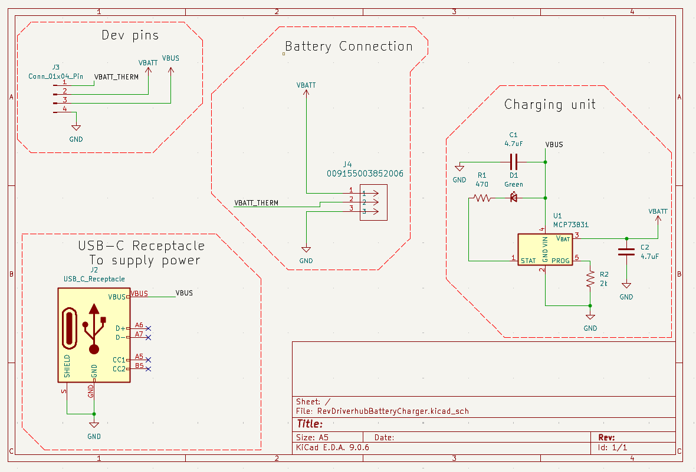
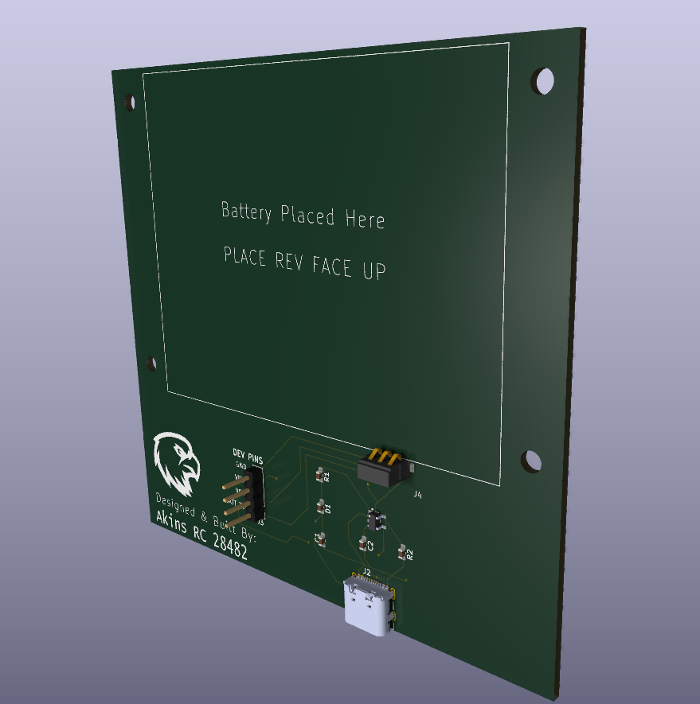
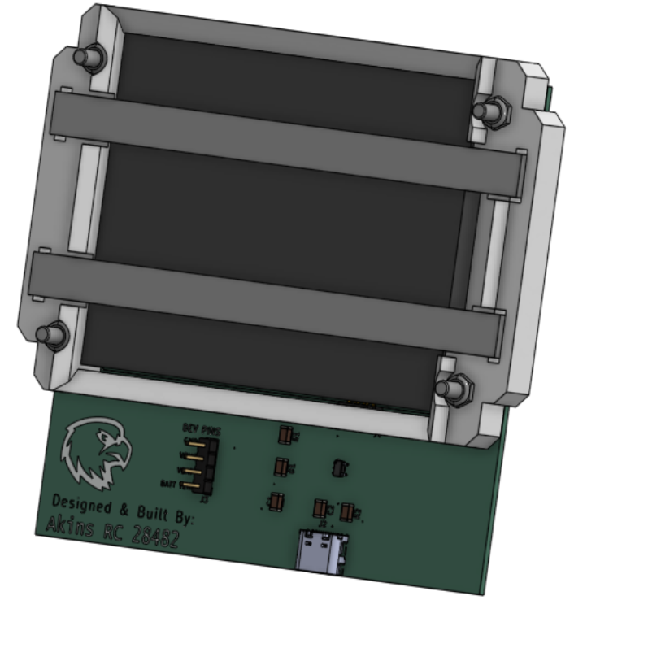

# REV-Driverhub-battery-charger
The REV Driverhub for FTC can't be used via direct power with a dead battery inside or turn on while charging a dead battery,
this is an independent battery charger so teams can use driver hub while the battery is charging. 
It can be powered by a usb c connected to a 5v power source.

# Features
- Charging for REV Driverhub battery
- 4 dev pins 
- USB C power delivery
- Charging status LED. 

# Schematic
Here's the Schematic, made in KiCAD,

# PCB
Here's the PCB I made in KiCAD. I selected my final components after routing, not berfore!
Not a good idea :sob:

# CAD
The only 3d printed part is the battery holder. It has some slots for velcro straps to add extra security to the battery hold.
REV Batteries can have pretty finicky connections, so I wanted to ensure a strong hold on the battery while being able to swap batteries
quickly and without tools.

